# Spring Cloud Gray - 微服务灰度中间件


[](https://www.apache.org/licenses/LICENSE-2.0.html)
[](https://github.com/SpringCloud/spring-cloud-gray/releases/tag/A.2.0.0)
[](https://github.com/SpringCloud/spring-cloud-gray/releases/tag/B.1.0.0)
[](https://github.com/SpringCloud/spring-cloud-gray/releases/tag/C.1.0.0)
[](https://github.com/SpringCloud/spring-cloud-gray/releases/tag/D.0.0.1)

## 介绍
Spring Cloud Gray 是一套开源的微服务灰度路由解决方案，它由spring-cloud-gray-client，spring-cloud-gray-client-netflix 和 spring-cloud-tray-server，spring-cloud-gray-webui组成。<br/>
spring-cloud-gray-client定义了一套灰度路由决策模型，灰度信息追踪模型，以及和spring-cloud-gray-server的基本通信功能。<br/>
spring-cloud-gray-client-netflix在spring-cloud-gray-client的基础上集成了微服务注册中心eureka，扩展ribbon的负载均衡规则，提供了对zuul,feign,RestTemplate的灰度路由能力，并且无缝支持hystrix线程池隔离。<br/>
spring-cloud-gray-server负责灰度决策、灰度追踪等信息的管理以及持久化。<br/>
spring-cloud-gray-webui提供操作界面。

**钉钉交流群**

二维码:<br/>


群链接:<br/>
https://qr.dingtalk.com/action/joingroup?code=v1,k1,a3CBsbJY9SfCfm+h+Yp7dQdDJufTZDPHgibBtIRoVRc=&_dt_no_comment=1&origin=11


## Demo
[点击查看](./spring-cloud-gray-samples)

在管控端数据库执行一条insert语名：
```sql
insert into `user` ( `user_id`, `account`, `name`, `password`, `roles`, `status`, `create_time`, `operator`, `operate_time`) values ( 'admin', 'admin', 'Admin', 'e7a57e51394e91cba19deca3337bfab0', 'admin', '1', now(), 'admin', now());
```
这是添加管理员账号的，用户名:`admin` 密码:`abc123`

## 使用手册
[管控端部署手册](doc/guide/guide-gray-server-deploy.md)<br/>
[客户端部署手册](doc/guide/guide-gray-client-deploy.md)<br/>
[管控端配置参数说明](doc/guide/gray-server-properties.md)<br/>
[客户端配置参数说明](doc/guide/gray-client-properties.md)<br/>
[管控端界面使用手册](doc/guide/gray-admin-guide.md)<br/>

## 版本信息
项目分支 | 项目版本 | srpingcloud版本 | springboot版本
--- | --- | --- | ---
A | A.2.0.0 | Edgware | 1.5.*
B | B.1.0.0 | Finchley | 2.0.*
C | C.1.0.0 | Greenwich | 2.1.*
D | D.0.0.1 | Hoxton | 2.3.*


## Spring Cloud Gray 能做什么
1. 金丝雀测试

	先发布1台实例，用于测试验证，指定测试的流量进入这台实例，其它流量依然进入其它正常的实例。优势在于发布成本小，快速测试，并且不影响正常用户体验影响，即使测试不通过，也只需回滚这一台实例，用户无感知。
	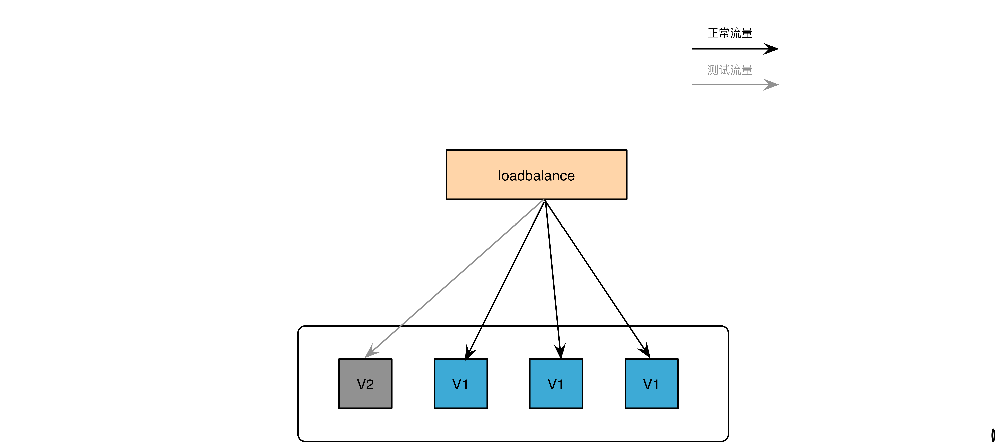

2. 灰度放量

	通过金丝雀测试后，可以逐渐放量到新的版本上。例如，根据userId或者ip放5%的流量到其中一台灰度实例上，观察一段时间没异常，可调整放入20%的流量，如果一台实例扛不住，可再发一台或多台实例。将发布产生的风险保持在可控范围内。
	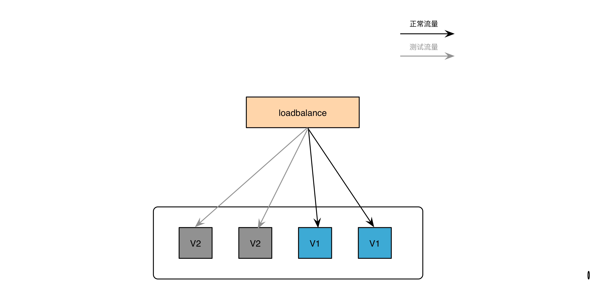
	
3. 切断实例流量

	当线上出现问题，可将某台实例的流量切断，保留现场，设置指定的请求进入实例，在线调试并且不影响其它用户。
	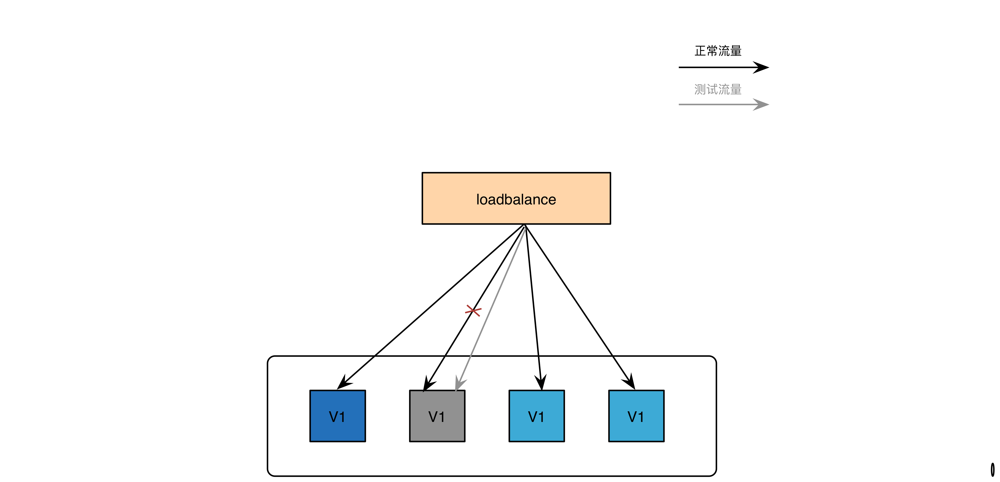

4. 数据透传

	借助灰度追踪的能力，在网关处记录用户请求的最初的数据，可以将之透传到请求完整的调用链中。
	
5. 借助“破窗”能力，实例蓝绿发布

	首次上灰度时，会存在两种环境，一种是已经依赖了灰度客户端的环境，另一种是正常运行的当前环境。假如微服务的负载均衡是由ribbon实现，那么当前环境会请求路由到实例状态为UP的实例上，而依赖了灰度客户端的环境，则可以通过"破窗"能力，跟灰度路由结合，可以将匹配灰度策略的请求路由到实例状态为STARTING的实例上，不匹配灰度策略的请求路由到实例状态为UP的实例上。 
	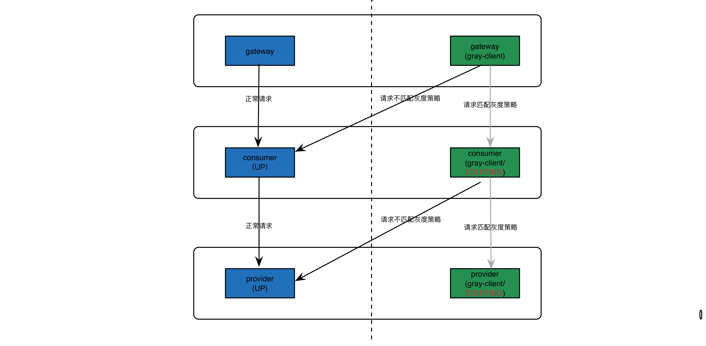


## 设计思想
在微服务架构中，接口的调用通常是服务消费方按照某种负载均衡策略去选择服务实例；但这无法满足线上更特殊化的一些路由逻辑，比如根据一次请求携带的请求头中的信息路由到某一个服务实例上。Spring Cloud Gray正是为此而创建。<br/>
在Spring Cloud Gray中定义了几个角色灰度客户端(gray-client)、灰度管控端(gray-server)、注册中心。<br/>
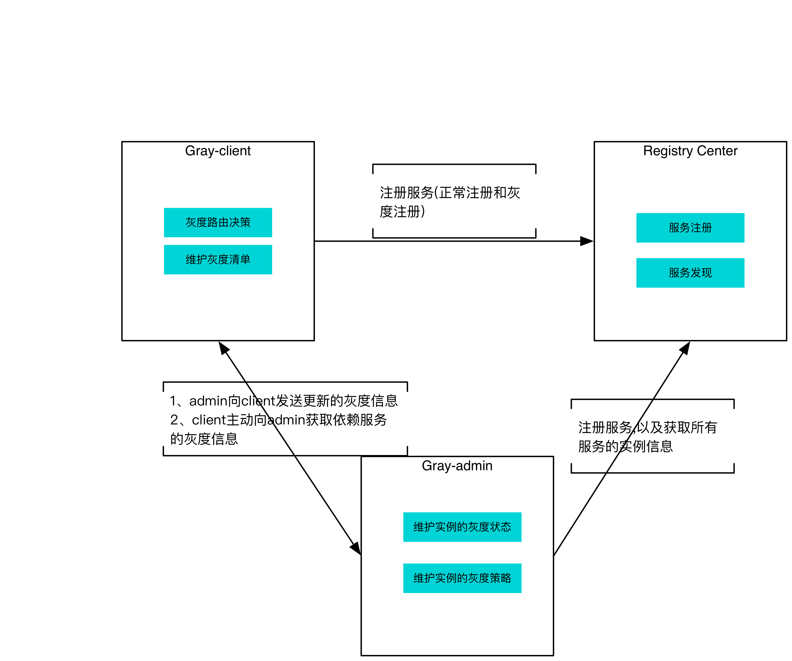

**注册中心**
负责服务的注册和发现。

**灰度客户端**
灰度的客户端是指依赖了spring-cloud-gray-client的服务，一般是指服务消费方。

**灰度管控端**
负责灰度信息的管理、持久化等维护工作。<br/>
灰度客户端会从灰度管控端拉取一份灰度信息的清单，并在内存中维护这份清单信息，清单中包含服务，服务实例，灰度策略，灰度追踪字段等。<br/>
当请求达到网关时，网关就会在灰度追踪中将需要透传的信息记录下来，并将传递给转发的服务实例，后面的接口调用也会按照同样的逻辑将追踪信息透传下去，从而保证所有一个请求在微服务调用链中的灰度路由。<br/>
如下图所示：


## 管控端的功能
1. 用户管理

	可添加用户，禁用用户，重置密码等。
	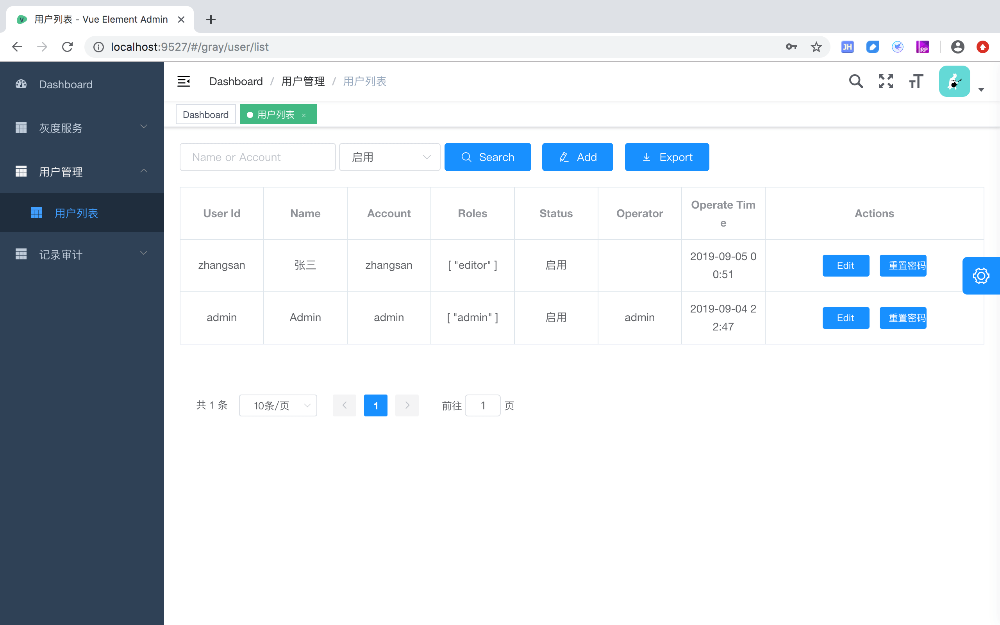
2. 服务列表
	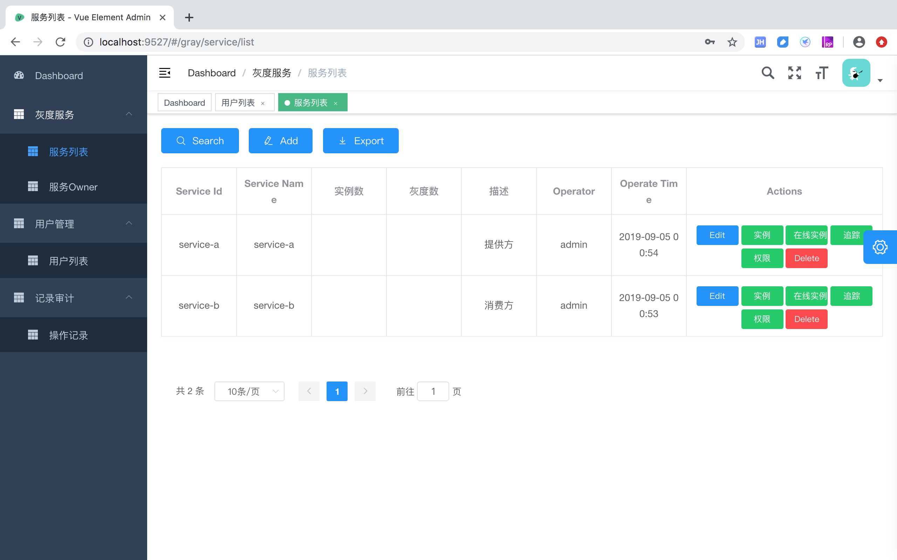
3. 权限控制

	灰度的权限控制是以服务为对象的，拥有服务的权限，就可以操作服务的所有灰度信息。在服务的权限控制中，分为两种角色，owner和管理者，owner拥有最大的权限，管理者除了不能删除owner的权限，其它权限同owner一样。 
	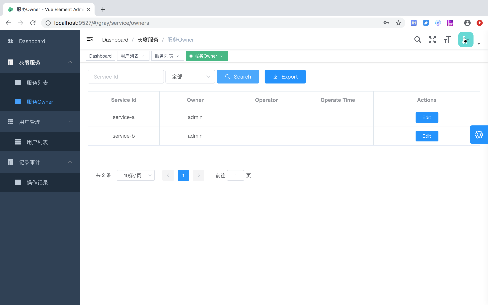
	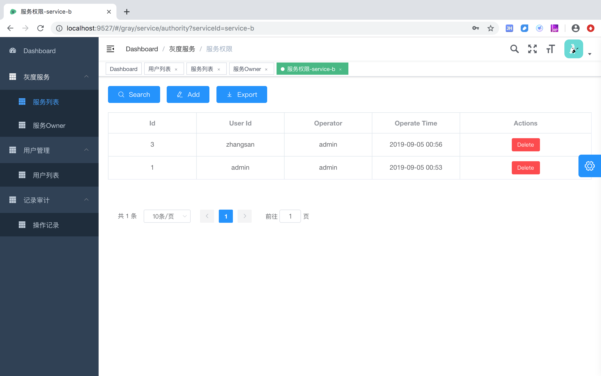
4. 灰度实例管理

	列出服务的灰度实例列表
	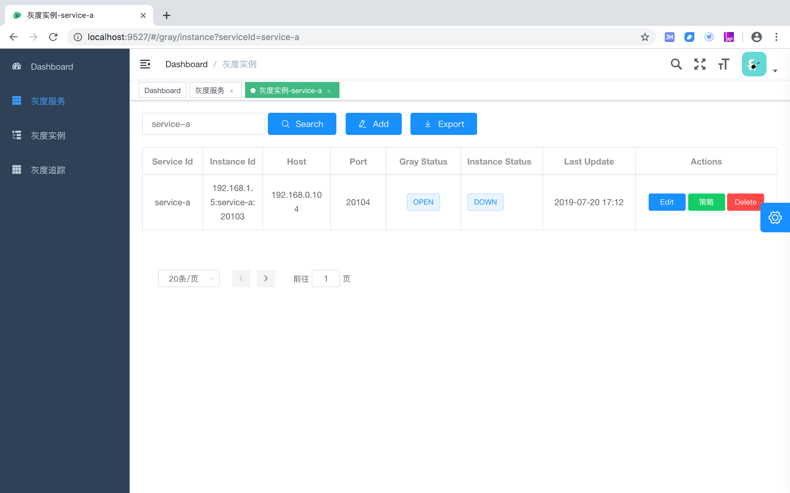
5. 在线实例列表

	列出指定服务在注册中心注册的实例，点击【Add】按钮，可快速添加为实例实例
	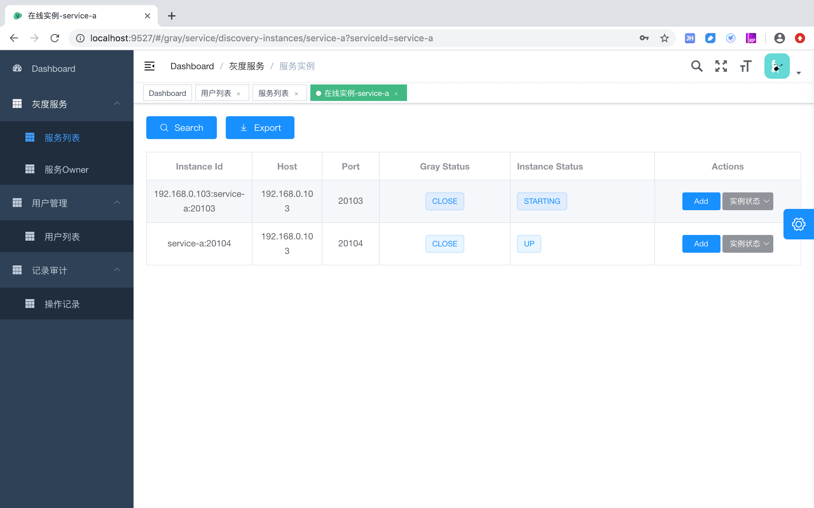
	
6. 编辑灰度策略

	从实例列表点击【策略】按钮进入灰度策略列表，可在策略列表中添加灰度策略和灰度决策。
    
    实例的灰度策略，包含可多个灰度决策。

    策略是从灰度实例列表进入。一个实例可以有多个灰度策略，策略与策略之间是"或"的关系。就是说，一个请求只要 满足实例的任意一个灰度策略，这个请求被路由到该实例上。
    
    决策是灰度中进行比对的最小项。它定义一种规则，对请求进行比对，返回 true/false。当请求调用时，灰度调用端可以根据灰度实例的灰度决策，进行对比，以判断灰度实例是否可以受理该请求。多个决策是"与"的关系。
	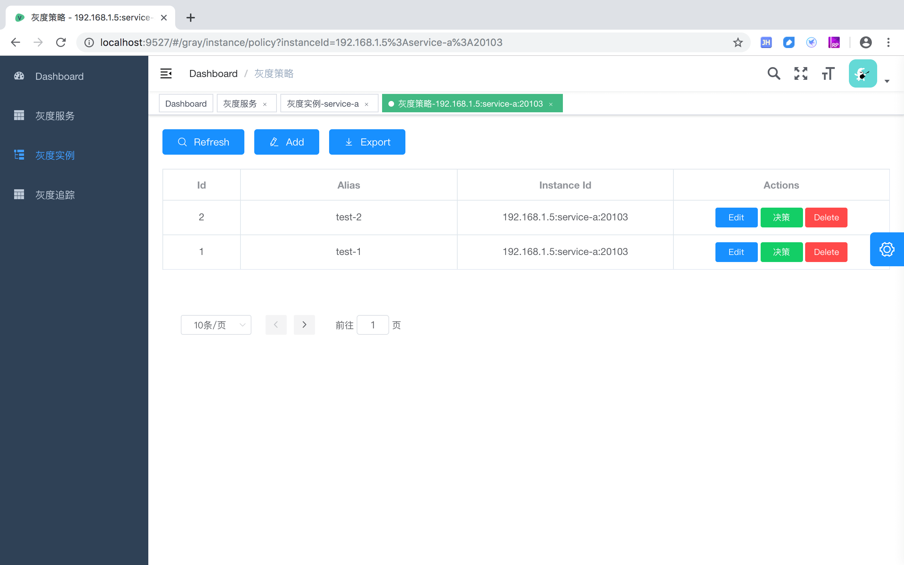
	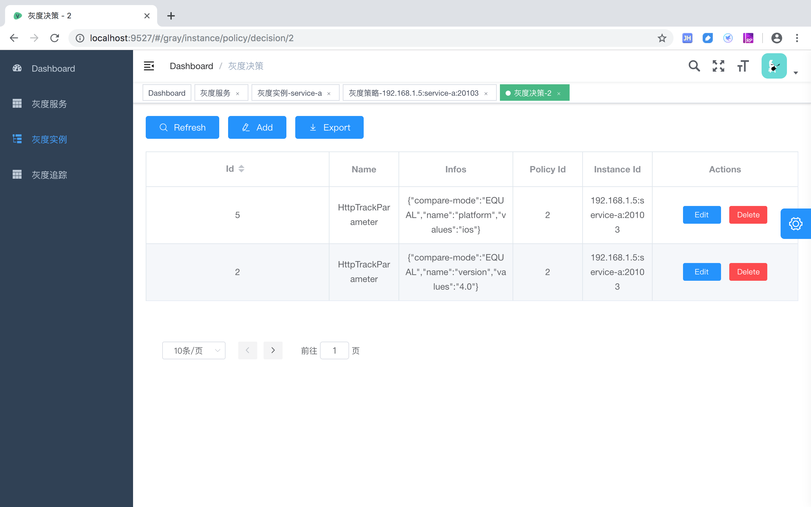



7. 编辑灰度追踪

	从服务列表点击【追踪】按钮进入
	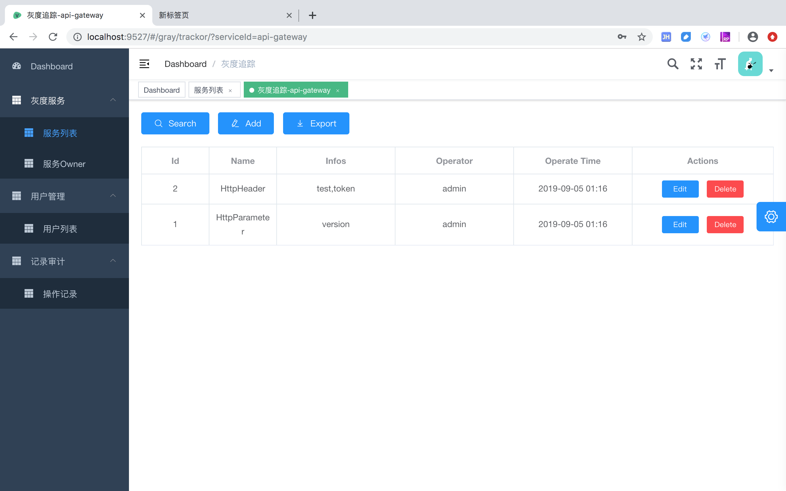
	
8. 改变实例状态

	可在实例列表中，通过【实例状态】按钮修改实例状态。提前是实例得依赖了灰度客户端的jar包，并且uri没有设置前缀(server.servlet.context-path)
	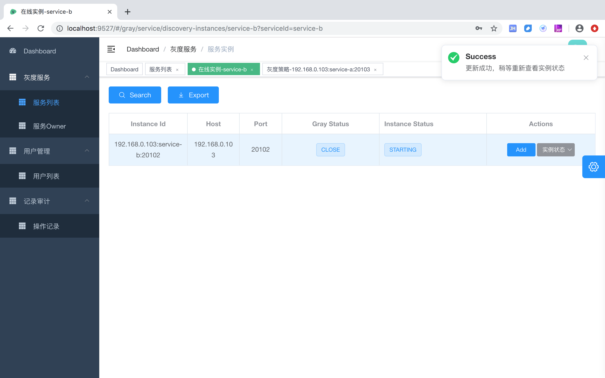
	
9. 操作审记

	所有的POST,PUT,DELETE操作都会被记录下来，可能通过操作记录查询，用于事后审计。
	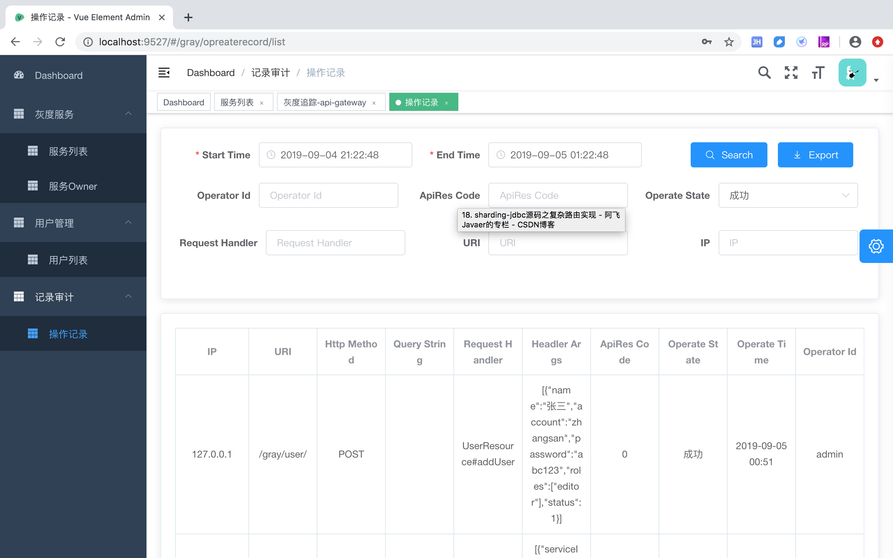
	
	查询维度包括：

* StartTime - EndTime
	记录时间 
	
* Operator Id
	操作人Id

* ApiRes Code
	接口返回的ApiRes Code
	
* operate State 
	操作的结果

* Request Hander
	spring mvc 的接口(Controller/Handler)的类名和方法
	
* URI
	接口的uri

* IP
	http请求(操作人)的ip


## 工程模块
功能模块

模块 | 描述
--- | ---
spring-cloud-gray-utils | 工具包
spring-cloud-gray-core | 灰度数据模型/Java Bean定义，client端和server端通用
spring-cloud-gray-client | 灰度客户端的核心代码，属于灰度客户端的内核
spring-cloud-gray-client-netflix | 灰度客户端与spring cloud netflix集成的代码，与之相关的插件都依赖这个模块
spring-cloud-gray-plugin-webmvc | 支撑灰度客户端在spring mvc运行的插件
spring-cloud-gray-plugin-webflux | 支撑灰度客户端在spring webfulx运行的插件(B版及以上)
spring-cloud-gray-plugin-eureka | 灰度客户端与注册中心eureka集成的插件
spring-cloud-gray-plugin-openfeign | 灰度客户端与openFiegn集成的插件
spring-cloud-gray-plugin-zuul | 灰度客户端与zuul 1.0集成的插件
spring-cloud-gray-plugin-gateway | 灰度客户端与spring cloud gateway集成的插件(B版及以上)
spring-cloud-gray-plugin-event-stream | 灰度客户端与spring cloud stream(rabbitmq)集成的插件
spring-cloud-gray-plugin-ribbon-nacos-discovery | 灰度客户端支持ribbon与注册中心nacos集成的插件
spring-cloud-gray-server | 灰度管控端的核心代码
spring-cloud-gray-server-plugin-eureka | 灰度管控端与注册中心eureka集成的插件
spring-cloud-gray-server-plugin-event-stream | 灰度管控端与spring cloud stream(rabbitmq)集成的插件
spring-cloud-gray-server-plugin-nacos-discovery | 灰度管控端与注册中心nacos集成的插件
spring-cloud-starter-gray-client | 灰度客户端starter
spring-cloud-starter-gray-server | 灰度管控端starter
spring-cloud-starter-gray-eureka-server | eureka server的灰度插件
spring-cloud-gray-webui | 灰度管控端的web界面，vue编写

示例模块

模块 | 描述
--- | ---
spring-cloud-gray-eureka-sample | eureka server/注册中心
spring-cloud-gray-server-sample | 灰度管控端示例，界面是spring-cloud-gray-webui模块
spring-cloud-gray-service-a-sample | 服务提供方示例
spring-cloud-gray-service-a1-sample | 服务提供方示例
spring-cloud-gray-ervice-b-sample | 服务消费方示例
spring-cloud-gray-zuul-sample | zuul网关示例
spring-cloud-gray-gateway-sample | spring-cloud-gateway网关示例(B版及以上)


## 灰度决策
灰度决策是灰度路由的关键，灰度决策由工厂类创建，工厂类的抽象接口是cn.springcloud.gray.decision.factory.GrayDecisionFactory。<br>
目前已有的灰度决策有：

名称 | 工厂类 | 描述
--- | --- | ---
HttpHeader | HttpHeaderGrayDecisionFactory | 根据http请求头的字段进行判断
HttpMethod | HttpMethodGrayDecisionFactory | 根据http请求方法的字段进行判断
HttpParameter | HttpParameterGrayDecisionFactory | 根据http url参数进行判断
HttpTrackHeader | HttpTrackHeaderGrayDecisionFactory | 根据灰度追踪记录的http请求头的字段进行判断
HttpTrackParameter | HttpTrackParameterGrayDecisionFactory | 根据灰度追踪记录的http url参数进行判断
TraceIpGray | TraceIpGrayDecisionFactory | 根据灰度追踪记录的请求ip进行判断
TrackAttribute | TrackAttributeGrayDecisionFactory | 根据灰度追踪记录的属性值进行判断
FlowRateGray | FlowRateGrayDecisionFactory | 按百分比放量进行判断

### 自定义灰度决策实现
如果上面这些决策还不能满足需求，那么可以扩展`cn.springcloud.gray.decision.factory.GrayDecisionFactory`，实现自定义的逻辑，发布到spring 容器中即可。如:
``` java
import cn.springcloud.gray.decision.GrayDecision;
import cn.springcloud.gray.decision.factory.AbstractGrayDecisionFactory;
import cn.springcloud.gray.request.GrayTrackInfo;
import lombok.Getter;
import lombok.Setter;
import org.apache.commons.lang3.StringUtils;
import org.springframework.stereotype.Component;

@Component
public class VersionGrayDecisionFactory extends AbstractGrayDecisionFactory<VersionGrayDecisionFactory.Config> {

    public VersionGrayDecisionFactory() {
        super(VersionGrayDecisionFactory.Config.class);
    }

    @Override
    public GrayDecision apply(Config configBean) {
        return args -> {
            GrayTrackInfo grayRequest = args.getGrayRequest().getGrayTrackInfo();
           int version = StringUtils.defaultIfNull(grayRequest.getAttribute(USER_ID_PARAM_NAME), "0");
            if(StringUtils.equal(configBean.getCompareMode(), "LT")){
                return configBean.getVersion() > version;
            }else if(StringUtils.equal(configBean.getCompareMode(), "GT")){
                return configBean.getVersion() < version;
            }else{
            	return configBean.getVersion() == version;
            }
        };
    }

    @Setter
    @Getter
    public static class Config {
        private String compareMode;
        private int varsion;
    }
}
```

## 灰度追踪
灰度追踪记录的逻辑是由cn.springcloud.gray.request.GrayInfoTracker的实现类实现。<br/>
目前已有的灰度追踪有:

名称 | 实现类 | 描述
--- | --- | ---
HttpReceive | HttpReceiveGrayInfoTracker | 接收调用端传递过来的灰追踪信息
HttpHeader | HttpHeaderGrayInfoTracker | 获取http请求的header并记录到灰度追踪的Header中
HttpIP | HttpIPGrayInfoTracker | 获取http请求的ip并记录到灰度追踪中
HttpMethod | HttpMethodGrayInfoTracker | 获取http请求的请求方法并记录到灰度追踪中
HttpParameter | HttpParameterGrayInfoTracker | 获取http请求的url参数并记录到灰度追踪的parameter中
HttpURI | HttpURIGrayInfoTracker | 获取http请求的URI并记录到灰度追踪中

### 自定义灰度追踪实现
如果上面这些决策还不能满足需求，那么可以扩展`cn.springcloud.gray.request.GrayInfoTracker`，实现自定义的逻辑，发布到spring 容器中即可。如:
``` java
import cn.springcloud.gray.request.GrayTrackInfo;
import cn.springcloud.gray.request.TrackArgs;
import cn.springcloud.gray.web.tracker.HttpGrayInfoTracker;
import lombok.extern.slf4j.Slf4j;
import org.springframework.security.core.Authentication;
import org.springframework.security.core.context.SecurityContext;
import org.springframework.security.core.context.SecurityContextHolder;
import org.springframework.security.core.userdetails.UserDetails;
import org.springframework.stereotype.Component;
import javax.servlet.http.HttpServletRequest;

@Slf4j
@Component
public class UserIdGrayInfoTracker implements HttpGrayInfoTracker {

    @Override
    public void call(TrackArgs<GrayTrackInfo, HttpServletRequest> args) {
        SecurityContext securityContext = SecurityContextHolder.getContext();
        Authentication authentication = securityContext.getAuthentication();
        String userId = null;
        if (authentication.getPrincipal() instanceof UserDetails) {
            UserDetails springSecurityUser = (UserDetails) authentication.getPrincipal();
            userId = springSecurityUser.getUsername();
        } else if (authentication.getPrincipal() instanceof String) {
            userId = (String) authentication.getPrincipal();
        }
        args.getTrackInfo().setAttribute("userId", userId);
    }
}
```

## 项目扩展
项目已经实现了灰度的内核，如果要与其它的注册中心或者负载均衡中间件集成，只需实现相应的plugin即可，spring cloud gray已经提供了eureka、ribbon、feign、zuul以及spring cloud gateway和spring cloud stream的plugin，添加相应的plugin依赖即可。


