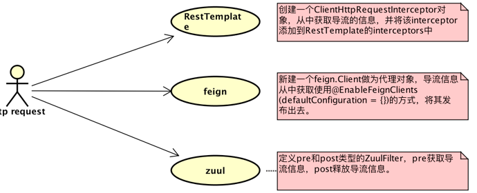
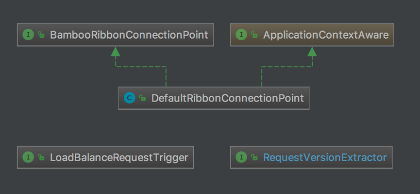

## 多版本控制

该项目是在spring-cloud-ribbon的基础上进行扩展，以实现接口的多个版本的调用及负载均衡，支持feign方式和断路器(spring-cloud-hystrix)。


##### 场景
服务A部署了两个实例 serivceA-1,serviceA-2, spring cloud ribbon默认是轮询的方式将请求分别转到两个实例上。如果由于业务原因，服务需要从1.0升级到2.0。

场景1：将所有服务实例平缓的过度到2.0。
场景2：2.0的服务实例需要兼容1.0的服务接口。


##### 思路
在spring cloud微服务体系中，服务的请求来源无外乎两个方面：
来源1：外部请求通过网关(zuul)转发而来。
来源2：内部服务之间的调用请求。
不论网关转发过来的请求，还是内部服务调用过来的请求，都需要ribbon做负载均衡，所以可以扩展ribbon的负载均衡策略从而实现不同版本的请求转发到不同的服务实例上。



网关的转发过程是:zuul > hystrix > ribbon
内部服务调用的过程有两种:
RestTemplate > hystrix > ribbon
Feign > hystrix > ribbon

而其中hystrix有一个线程池隔离的能力，会创建另一个线程去请求服务，拥有更好的控制并发访问量、以及服务降级等能力，但是会出现一个问题，就是线程变量(ThreadLocal)的传递问题，这可以通过com.netflix.hystrix.strategy.concurrency.HystrixRequestVariableDefault对象解决。


##### 代码设计
虽然整个项目实现起来代码量不少， 但是在接口设计上， 却只有三个简单的接口负责数据传递，路由的逻辑依然是封装在实现了IRule接口的实现类中(后面分析)。



* BambooRibbonConnectionPoint
这个接口是负责将bamboo跟ribbon连接起来的，将请求的信息， 以及根据业务需要添加的一些路由信息，和获取请求接口的目标版本，还有触发执行LoadBanceRequestTrigger等，都是由该接口的实现类DefaultRibbonConnectionPoint负责实现。
```java 
public class DefaultRibbonConnectionPoint implements BambooRibbonConnectionPoint, ApplicationContextAware {
    ...
    @Override
    public void executeConnectPoint(ConnectPointContext connectPointContext) {
        ConnectPointContext.contextLocal.set(connectPointContext);
        BambooRequest bambooRequest = connectPointContext.getBambooRequest();
        String requestVersion = versionExtractor.extractVersion(bambooRequest);
        BambooRequestContext.initRequestContext(bambooRequest, requestVersion);
        executeBeforeReuqestTrigger();
    }

    @Override
    public void shutdownconnectPoint() {
        try {
            executeAfterReuqestTrigger();
        } catch (Exception e) {
            ConnectPointContext.getContextLocal().setExcption(e);
        } finally {
            curRequestTriggers.remove();
            ConnectPointContext.contextLocal.remove();
            BambooRequestContext.shutdownRequestContext();
        }
    }
    ...
}
```


* RequestVersionExtractor
这个接口负责获取请求需要访问的目标接口的版本。比如有些接口版本是放在路径上，如:/v1/api/test/get。也有放在uri参数中:/api/test/get?v=1。也有可能放到header中，所以在bamboo抽象出来一个接口， 具体的实现由开发者根据业务去实现。


* LoadBalanceRequestTrigger
Ribbon请求的触发器，在ribbon请求发起时， 会被执行。这个接口有三个方法，分别是判断是否需要执行的方法(shouldExecute)，以及请求之前执行(before)和请求完成之后执行(after)，如果出现异常，after方法依然会被执行。


##### 代码实现
上面三个接口只是简单的实现了获取请求的目标版本、触发ribbon请求的触发器，以及将信息向下一步传递。在这一段中，将介绍如何与zuul、feign、RestTemplate以及ribbon和hystrix衔接起来。

* RestTemplate衔接
ClientHttpRequestInterceptor是RestTemplate的拦截器接口，可以通过这个接口添加bamboo的逻辑， 从而将RestTemplate和bamboo衔接起来。
BambooClientHttpRequestIntercptor是ClientHttpRequestInterceptor接口的实现类，它加入了bamboo的逻辑。
```java
/**
 * 用于@LoadBalance 标记的 RestTemplate，主要作用是用来获取request的相关信息，为后面的路由提供数据基础。
 */
public class BambooClientHttpRequestIntercptor implements ClientHttpRequestInterceptor {
    @Override
    public ClientHttpResponse intercept(HttpRequest request, byte[] body, ClientHttpRequestExecution execution) throws IOException {

        URI uri = request.getURI();
        BambooRequest bambooRequest = BambooRequest.builder()
                .serviceId(uri.getHost())
                .uri(uri.getPath())
                .ip(RequestIpKeeper.getRequestIp())
                .addMultiHeaders(request.getHeaders())
                .addMultiParams(WebUtils.getQueryParams(uri.getQuery()))
                .build();

        ConnectPointContext connectPointContext = ConnectPointContext.builder().bambooRequest(bambooRequest).build();
        try {
            BambooAppContext.getBambooRibbonConnectionPoint().executeConnectPoint(connectPointContext);
            return execution.execute(request, body);
        } finally {
            BambooAppContext.getBambooRibbonConnectionPoint().shutdownconnectPoint();
        }
    }
}
```

* Feign衔接
BambooFeignClient类实现了feign.Client接口， 该类是一个代理类，主要的Feign的调用逻辑依然由被代理的类去执行，在该类中添加了bamboo的逻辑，从而将Feign和bamboo衔接起来。
```java
/**
 * 主要作用是用来获取request的相关信息，为后面的路由提供数据基础。
 */
public class BambooFeignClient implements Client {

    private Client delegate;


    public BambooFeignClient(Client delegate) {
        this.delegate = delegate;
    }

    @Override
    public Response execute(Request request, Request.Options options) throws IOException {
        URI uri = URI.create(request.url());
        BambooRequest.Builder builder = BambooRequest.builder()
                .serviceId(uri.getHost())
                .uri(uri.getPath())
                .ip(RequestIpKeeper.getRequestIp())
                .addMultiParams(WebUtils.getQueryParams(uri.getQuery()));

        request.headers().entrySet().forEach(entry ->{
            for (String v : entry.getValue()) {
                builder.addHeader(entry.getKey(), v);
            }
        });

        ConnectPointContext connectPointContext = ConnectPointContext.builder().bambooRequest(builder.build()).build();

        try {
            BambooAppContext.getBambooRibbonConnectionPoint().executeConnectPoint(connectPointContext);
            return delegate.execute(request, options);
        }finally {
            BambooAppContext.getBambooRibbonConnectionPoint().shutdownconnectPoint();
        }
    }
}
```


* Zuul衔接
实现两个ZuulFilter接口，分别是pre和post类型，将bamboo的逻辑加入其中。Pre类型的ZuulFilter获取请求信息，并执行LoadBalanceRequestTrigger#before方法。Post类型的ZuulFilter执行LoadBalanceRequestTrigger#after方法，并清除存在ThradLocal中的相关信息。
```java
/**
 * 主要作用是用来获取request的相关信息，为后面的路由提供数据基础。
 */
public class BambooPreZuulFilter extends ZuulFilter {
    @Override
    public String filterType() {
        return FilterConstants.PRE_TYPE;
    }

    @Override
    public int filterOrder() {
        return 10000;
    }

    @Override
    public boolean shouldFilter() {
        return true;
    }

    @Override
    public Object run() {
        RequestContext context = RequestContext.getCurrentContext();
        BambooRequest.Builder builder = BambooRequest.builder()
                .serviceId((String)context.get(FilterConstants.SERVICE_ID_KEY))
                .uri((String)context.get(FilterConstants.REQUEST_URI_KEY))
                .ip(context.getZuulRequestHeaders().get(FilterConstants.X_FORWARDED_FOR_HEADER.toLowerCase()))
                .addMultiParams(context.getRequestQueryParams())
                .addHeaders(context.getZuulRequestHeaders())
                .addHeaders(context.getOriginResponseHeaders().stream().collect(Collectors.toMap(Pair::first, Pair::second)));
        context.getOriginResponseHeaders().forEach(pair-> builder.addHeader(pair.first(), pair.second()));

        ConnectPointContext connectPointContext = ConnectPointContext.builder().bambooRequest(builder.build()).build();

        BambooAppContext.getBambooRibbonConnectionPoint().executeConnectPoint(connectPointContext);
        return null;
    }

}
```
```java
/**
 * 做一些善后工作。比如删除BambooRequestContext在ThreadLocal中的信息。
 */
public class BambooPostZuulFilter extends ZuulFilter {
    @Override
    public String filterType() {
        return FilterConstants.POST_TYPE;
    }

    @Override
    public int filterOrder() {
        return 0;
    }

    @Override
    public boolean shouldFilter() {
        return true;
    }

    @Override
    public Object run() {
//        BambooRequestContext.shutdownRequestContext();
        BambooAppContext.getBambooRibbonConnectionPoint().shutdownconnectPoint();
        return null;
    }
}
```

* Hystrix衔接
Hystrix实现降级、断路器等功能，但是在使用线程池隔离时，ThreadLocal存储的信息如何传递下去呢?使用HystrixRequestVariableDefault可以解决这个问题。可以查看com.netflix.hystrix.strategy.concurrency包下的HystrixContexSchedulerAction、HystrixContextCallable、HystrixContextRunnable，它们都有一段相同功能的代码
```java
public class HystrixContextRunnable implements Runnable {

    private final Callable<Void> actual;
    private final HystrixRequestContext parentThreadState;
    
    //...
    
    @Override
    public void run() {
        HystrixRequestContext existingState = HystrixRequestContext.getContextForCurrentThread();
        try {
            // set the state of this thread to that of its parent
            HystrixRequestContext.setContextOnCurrentThread(parentThreadState);
            // execute actual Callable with the state of the parent
            try {
                actual.call();
            } catch (Exception e) {
                throw new RuntimeException(e);
            }
        } finally {
            // restore this thread back to its original state
            HystrixRequestContext.setContextOnCurrentThread(existingState);
        }
    }

}
```
parentThreadState也是一个HystrixRequestContext对象，它是在hystrix创建线程之前的，也就是处理http请求的线程的HystrixRequestContext对象，我们一般也是维护这个对象。在使用线程池隔离时，hystrix会将parentThreadState中的信息复到到新线程中，实现跨线程的数据传递，从而在后面的逻辑中可以获取到parentThreadState中维护的信息，包括ribbon的路由信息。在bamboo中，将一步骤的逻辑放到BambooRequestContext中，将BambooRequestContext实例本身传递下去。
```java
public class BambooRequestContext {

    private static final Logger log = LoggerFactory.getLogger(BambooRequestContext.class);

    private static final HystrixRequestVariableDefault<BambooRequestContext> CURRENT_CONTEXT = new HystrixRequestVariableDefault<BambooRequestContext>();


    private final String apiVersion;
    private final BambooRequest bambooRequest;
    private Map<String, Object> params;


    private BambooRequestContext(BambooRequest bambooRequest, String apiVersion) {
        params = new HashMap<>();
        this.apiVersion = apiVersion;
        this.bambooRequest = bambooRequest;
    }


    public static BambooRequestContext currentRequestCentxt() {
        return CURRENT_CONTEXT.get();
    }

    public static void initRequestContext(BambooRequest bambooRequest, String apiVersion) {
        if (!HystrixRequestContext.isCurrentThreadInitialized()) {
            HystrixRequestContext.initializeContext();
        }
        CURRENT_CONTEXT.set(new BambooRequestContext(bambooRequest, apiVersion));
    }

    public static void shutdownRequestContext() {
        if (HystrixRequestContext.isCurrentThreadInitialized()) {
            HystrixRequestContext.getContextForCurrentThread().shutdown();
        }
    }

    //忽略setter/getter
}
```

* Ribbon 路由规则
Bamboo中的BambooZoneAvoidanceRule继承了ZoneAvoidanceRule,所以它会有ZvoidanceRule的一切特性，在此基础上，还加入了版本过滤的逻辑，这个逻辑主要是由BambooApiVersionPredicate实现。从BambooRequestContext中获取请求的接口的版本，如果有该没有获取到版本，就返回true;如果有获取到版本，就获取服务实例的metadata中的version信息，并进行匹配校验，返回结果。
```java
public class BambooApiVersionPredicate extends AbstractServerPredicate {


    public BambooApiVersionPredicate(BambooZoneAvoidanceRule rule) {
        super(rule);
    }

    @Override
    public boolean apply(PredicateKey input) {
        BambooLoadBalancerKey loadBalancerKey = getBambooLoadBalancerKey(input);
        if (loadBalancerKey != null && !StringUtils.isEmpty(loadBalancerKey.getApiVersion())) {
            Map<String, String> serverMetadata = ((BambooZoneAvoidanceRule) this.rule)
                    .getServerMetadata(loadBalancerKey.getServiceId(), input.getServer());
            String versions = serverMetadata.get("versions");
            return matchVersion(versions, loadBalancerKey.getApiVersion());
        }
        return true;
    }

    private BambooLoadBalancerKey getBambooLoadBalancerKey(PredicateKey input) {
        if(BambooRequestContext.currentRequestCentxt()!=null){
            BambooRequestContext bambooRequestContext = BambooRequestContext.currentRequestCentxt();
            String apiVersion = bambooRequestContext.getApiVersion();
            if(!StringUtils.isEmpty(apiVersion)){
                return BambooLoadBalancerKey.builder().apiVersion(apiVersion)
                        .serviceId(bambooRequestContext.getServiceId()).build();
            }
        }
        return null;
    }
    //...
}
```

##### 使用说明
多版本控制 --> [spring-cloud-mult-version-samples](../spring-cloud-mult-version-samples/README.md)