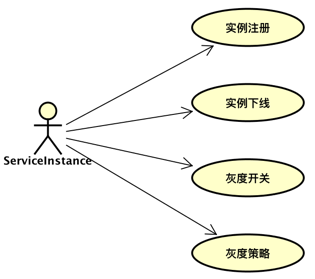
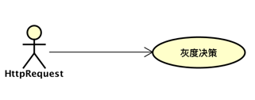
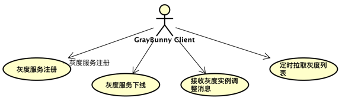
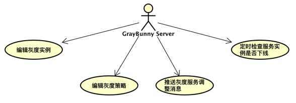
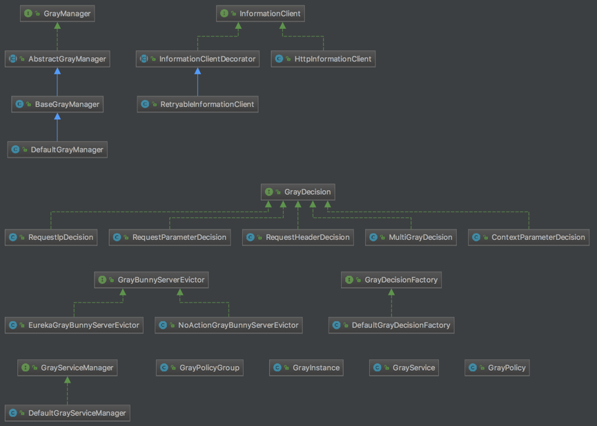

## 灰度发布
灰度发布是在多版本控制的基础上进一步扩展实现出来的项目 -> fm-cloud-graybunny，抽象出灰度服务、灰度服务实例、灰度策略、灰度决策等。支持A/B test, 金丝雀 test。 灰度策略可以从request ip, request patameter, request header等方面进行去创建，也可以根据bamboo的LoadBalanceRequestTrigger结合graybuanny的接口去扩展灰度策略和灰度决策。

##### 场景

有两个服务，共四个服务实例，分别是ServiceA-1, ServiceA-2, ServiceB-1。其中ServiceA-2是灰度实例。
场景1：所有请求头usertype:old，ip:10.217.***.***的请求或者请求头usertype:test, url 参数action:create的请求，都会被转发到的灰度服务ServiceA-2 。
场景2：ServiceA-2通过一段时间的观察，判定运行稳定，开始ServiceA-2删除灰度标记，开始和ServiceA-1一样会加入正常的负载均衡规则当中。
场景3：服务ServiceB发布新版本，ServiceB-2需要灰度注册，注册成功后所有的请求不能转发到ServiceB-2, 在为ServiceB-2设置灰度策略后，符合策略的请求才会被转发到ServiceB-2上。


##### 思路

从上面的场景分析，可以归纳出两个对象：服务实例和调用请求；服务实例的灰度管理是基础，调用请求时如何决策路由，都是根据服务实例的灰度策略去判断的。既然有灰度管理这个概念，那么从功能上分，就会有client-server之分，所以又可以从gray-client和gray-server去分析。接下来将一步一步去分析这四个方面。

* 灰度实例



实例注册：服务实例添加到灰度管理中。
实例下线：服务实例下线，从灰度管理中删除。
灰度开关：调整服务实例的灰度状态，有启用、禁用两个状态，禁用的实例不纳入灰度列表中。
灰度策略：请求是否可以被转发到该服务实例的条件，只有通过，请求才有可能会被转发到该实例上。

* 调用请求



灰度决策：根据请求的信息去匹配灰度服务实例的灰度策略，如果匹配上，会将服务实例加入到通过列表中。如果都没有匹配上，就按bamboo的路由规则去筛选非灰度的服务实例进行转发。


* 灰度客户端

调用请求的服务消费者，和提供服务的服务提供者都可以是灰度客户端，因为微服务中，大多服务实例既是服务提供者，同时也是服务消费者。



灰度服务注册：服务实例在启动时，就会向灰度服务端发起请求，将实例自身的灰度开关打开。
灰度服务下线：在服务实例下线前，会触发钩子，向灰度服务端发起请求将实例自身从灰度列表中删除。
接收灰度实例调整消息：接收由灰度服务端推送过来的灰度列表更新消息比如新增灰度实例，删除灰度实例等，维护缓存在实例上的灰度列表。
定时拉取灰度列表：定时从灰度服务端拉取最新的灰度列表，维护实例自身缓存的灰度列表。

* 灰度服务端

灰度服务端负表维护灰度列表，可以新增、删除、编辑灰度信息。



编辑灰度实例：新增灰度实例，删除灰度实例，修改实例灰度状态。
编辑灰度策略：新增实例灰度策略，删除实例灰度策略，修改灰度策略状态。
推送灰度服务调整消息：向灰度客户端推送灰度列表变动消息，比如新增灰度实例，删除灰度实例，修改实例灰度状态等。
定时检查服务实例是否下线：定时检查灰度服务实例是否下线，下线的的实例将从灰度列表中删除。


##### 代码设计
根据上面的思路，设计以下对象和接口。共6个接口，4个模型对象。



对象：
* GrayService: 灰度服务
* GrayInstance: 灰度实例，有状态属性
* GrayPolicyGroup: 灰度策略组，有状态属性
* GrayPolicy: 灰度策略

接口:
* GrayManager:
灰度客户端管理器，维护灰度列表，维护自身灰度状态，创建灰度决策对象。抽象实现类AbstractGrayManager实现了基础的获取灰度列表， 创建灰度决策对象的能力。BaseGrayManger在期基础上进行了扩展，将灰度列表缓存起来，定时从灰度服务端更新灰度列表。

* InformationClient:
该接口主要是负责和灰度服务端进行通信，获取灰度列表，编辑灰度实例等能力。其实现类HttpInformationClient默认使用http方式访问灰度服务端。
子类InformationClientDecorator是一个适配器类，RetryableInformationClient继承了InformationClientDecorator类，实现了重试的功能。

* GrayDecision:
该接口是灰度决策，用来判断请求是否匹配灰度策略。实现了ip匹配、request parameter匹配、request header匹配、BambooRequestContext中的参数匹配器以及合并匹配等多个匹配能力。

* GrayDecisionFactory:
灰度决策的工厂类，其默认实现类支持上述几种灰度决策的创建。

* GrayServiceManager: 
灰度服务管理类，属于服务端的类。主要是编辑服务实例，编辑灰度策略，以及维护最新的灰度列表。

* GrayBunnyServerEvictor:
如果灰度服务实例下线后， 由于意外情况，没有向灰度服务端发送删除请求， 服务端会每隔一段时间调用该接口的方法，检查灰度列表中的实例是否下线，如果实例已下线，就将其从灰度列表中删除。


##### 代码实现
将模型抽象成接口和对象设计出来之后，实现思路就清晰了。

* 灰度路由:
灰度路由是客户端必须要实现的能力，gray是在bamboo的基础上扩展的，所以gray的路由规则对象GrayLoadBalanceRule继承了BambooZoneAvoidanceRule，
逻辑是这样的：
1、	判断目标服务是否有灰度实例。
2．1、 如果没有， 执行父类逻辑。结束。
2.2、 有灰度实例，先将灰度实例和非灰度实例筛选出来。
3、 挑选灰度实例， 筛选调用请求匹配上灰度实例的策略。
4.1、 如果没有匹配的灰度实例， 将非灰度实例列表传递过去执行父类的筛选逻辑。结束。
4．2、 如果有匹配的灰度实例， 从其中按轮询的方式挑选出一个实例。结束。
```java
/**
 * 灰度发布的负载规则
 */
public class GrayLoadBalanceRule extends BambooZoneAvoidanceRule {

    protected CompositePredicate grayCompositePredicate;

    public GrayLoadBalanceRule() {
        super();
        GrayDecisionPredicate apiVersionPredicate = new GrayDecisionPredicate(this);
        grayCompositePredicate = CompositePredicate.withPredicates(super.getPredicate(),
                apiVersionPredicate).build();
    }


    @Override
    public Server choose(Object key) {
        ILoadBalancer lb = getLoadBalancer();
        BambooRequestContext requestContext = BambooRequestContext.currentRequestCentxt();
        if (requestContext != null && getGrayManager().isOpen(requestContext.getServiceId())) {
            GrayService grayService = getGrayManager().grayService(requestContext.getServiceId());
            List<Server> servers = lb.getAllServers();
            List<Server> grayServers = new ArrayList<>(grayService.getGrayInstances().size());
            List<Server> normalServers = new ArrayList<>(servers.size() - grayService.getGrayInstances().size());
            for (Server server : servers) {
                DiscoveryEnabledServer disServer = (DiscoveryEnabledServer) server;
                if (grayService.getGrayInstance(disServer.getInstanceInfo().getInstanceId()) != null) {
                    grayServers.add(server);
                } else {
                    normalServers.add(server);
                }
            }

            Optional<Server> server = grayCompositePredicate.chooseRoundRobinAfterFiltering(grayServers, key);
            if (server.isPresent()) {
                return server.get();
            } else {
                return choose(super.getPredicate(), normalServers, key);
            }
        }
        return super.choose(key);
    }


    private Server choose(AbstractServerPredicate serverPredicate, List<Server> servers, Object key) {
        Optional<Server> server = serverPredicate.chooseRoundRobinAfterFiltering(servers, key);
        if (server.isPresent()) {
            return server.get();
        } else {
            return null;
        }
    }


    public GrayManager getGrayManager() {
        return GrayClientAppContext.getGrayManager();
    }
}

```

灰度决策的执行代码在GrayDecisionPredicate中

```java
public class GrayDecisionPredicate extends AbstractServerPredicate {

    public GrayDecisionPredicate(GrayLoadBalanceRule rule) {
        super(rule);
    }

    @Override
    public boolean apply(PredicateKey input) {
        BambooRequestContext bambooRequestContext = BambooRequestContext.currentRequestCentxt();
        if (bambooRequestContext == null || bambooRequestContext.getBambooRequest() == null) {
            return false;
        }
        DiscoveryEnabledServer server = (DiscoveryEnabledServer) input.getServer();
        BambooRequest bambooRequest = bambooRequestContext.getBambooRequest();
        List<GrayDecision> grayDecisions =
                getIRule().getGrayManager().grayDecision(bambooRequest.getServiceId(), server.getInstanceInfo().getInstanceId());
        for (GrayDecision grayDecision : grayDecisions) {
            if (grayDecision.test(bambooRequest)) {
                return true;
            }
        }
        return false;
    }


    protected GrayLoadBalanceRule getIRule() {
        return (GrayLoadBalanceRule) this.rule;
    }
}
```

* 灰度管理:
灰度管理是灰度服务端的功能，主要是维护灰度列表。其实现类DefaultGrayServiceManager有一个Map, 用来维护GrayService，key是service id。并且每隔一段时间就调用EurekaGrayServerEvictor，检查列表中的实例是否下线，将下线的服务从灰度列表中删除。

```java
public class DefaultGrayServiceManager implements GrayServiceManager {


    private Map<String, GrayService> grayServiceMap = new ConcurrentHashMap<>();
    private Timer evictionTimer = new Timer("Gray-EvictionTimer", true);

    //...
    
    @Override
    public void openForWork() {
        evictionTimer.schedule(new EvictionTask(),
                serverConfig.getEvictionIntervalTimerInMs(),
                serverConfig.getEvictionIntervalTimerInMs());
    }

    @Override
    public void shutdown() {
        evictionTimer.cancel();
    }


    protected void evict() {
        GrayServerContext.getGrayServerEvictor().evict(this);
    }


    class EvictionTask extends TimerTask {

        @Override
        public void run() {
            evict();
        }
    }

}

```

EurekaGrayServerEvictor是依赖EurekaClient来检查服务实例是否下线。

```java
public class EurekaGrayServerEvictor implements GrayServerEvictor {

    private EurekaClient eurekaClient;


    public EurekaGrayServerEvictor(EurekaClient eurekaClient) {
        this.eurekaClient = eurekaClient;
    }

    @Override
    public void evict(GrayServiceManager serviceManager) {
        Collection<GrayService> grayServices = serviceManager.allGrayService();
        grayServices.forEach(grayService -> {
            grayService.getGrayInstances().forEach(grayInstance -> {
                evict(serviceManager, grayInstance);
            });
        });

    }


    private void evict(GrayServiceManager serviceManager, GrayInstance grayInstance) {
        if (isDownline(grayInstance)) {
            serviceManager.deleteGrayInstance(grayInstance.getServiceId(), grayInstance.getInstanceId());
        }
    }


    private boolean isDownline(GrayInstance grayInstance) {
        Application app = eurekaClient.getApplication(grayInstance.getServiceId());
        return app == null || app.getByInstanceId(grayInstance.getInstanceId()) == null;
    }

}
```


##### 使用说明
灰度发布 --> [spring-cloud-gray-samples](../spring-cloud-gray-samples/README.md)