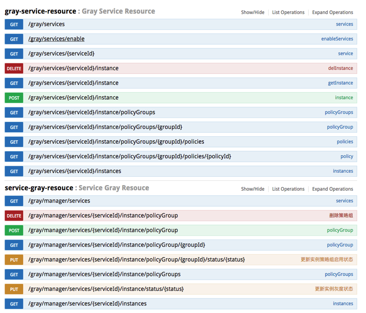

## 灰度发布使用说明
(以下说明都是假设浏览者对spring-cloud-netflix有过了解)
灰度管理的配置和bamboo的配置是一样的， 配置方式差别不大。不过由于gray-server需要注册到eureka，所以要先运行eureka-server。下面先说gray-server的配置。

##### gray-server
在项目的pom.xml加入spring-boot相关的依赖，再加入spring-cloud-starter-gray-server，然后启动就可以了。比如spring-cloud-gray-server-sample
```xml
    <dependencies>
        <dependency>
            <groupId>org.springframework.boot</groupId>
            <artifactId>spring-boot-starter-web</artifactId>
        </dependency>
        <dependency>
            <groupId>org.springframework.boot</groupId>
            <artifactId>spring-boot-starter-test</artifactId>
        </dependency>
        <dependency>
            <groupId>org.springframework.cloud</groupId>
            <artifactId>spring-cloud-starter-zookeeper-discovery</artifactId>
        </dependency>
        
        <dependency>
            <groupId>cn.springcloud.gray</groupId>
            <artifactId>spring-cloud-starter-gray-server</artifactId>
        </dependency>

    </dependencies>
```

在启动类中，需要启用服务发现，以及@EnableGrayServer。

```java
@SpringBootApplication
@EnableGrayServer
@EnableDiscoveryClient
public class GrayServerApplication {

    private static final org.slf4j.Logger log = LoggerFactory.getLogger(GrayServerApplication.class);


    public static void main(String[] args) throws UnknownHostException {
        Environment env = new SpringApplicationBuilder(GrayServerApplication.class).web(true).run(args).getEnvironment();
        log.info(
                "\n----------------------------------------------------------\n\t"
                        + "Application '{}' is running! Access URLs:\n\t" + "Local: \t\thttp://127.0.0.1:{}\n\t"
                        + "External: \thttp://{}:{}\n----------------------------------------------------------",
                env.getProperty("spring.application.name"), env.getProperty("server.port"),
                InetAddress.getLocalHost().getHostAddress(), env.getProperty("server.port"));

        String configServerStatus = env.getProperty("configserver.status");
        log.info(
                "\n----------------------------------------------------------\n\t"
                        + "Config Server: \t{}\n----------------------------------------------------------",
                configServerStatus == null ? "Not found or not setup for this application" : configServerStatus);
    }
}
```

启动后，可以访问 http://localhost:20202/swagger-ui.html 查看接口列表，也可以调用其中的接口。



以上介绍完了gray-server的配置，下面再看gray-client的配置。


##### gray-client

1、在pom.xml中加入spring-cloud-starter-gray。比如spring-cloud-gray-service-b-sample
```xml
    <dependencies>
            <dependency>
                <groupId>org.springframework.boot</groupId>
                <artifactId>spring-boot-starter-web</artifactId>
            </dependency>
            <dependency>
                <groupId>org.springframework.boot</groupId>
                <artifactId>spring-boot-starter-test</artifactId>
            </dependency>
            <dependency>
                <groupId>org.springframework.cloud</groupId>
                <artifactId>spring-cloud-starter-zookeeper-discovery</artifactId>
            </dependency>
            <dependency>
                <groupId>org.apache.commons</groupId>
                <artifactId>commons-lang3</artifactId>
            </dependency>
    
    
            <dependency>
                <groupId>cn.springcloud.gray</groupId>
                <artifactId>spring-cloud-starter-gray</artifactId>
            </dependency>
        </dependencies>
```

2、在application.yaml中加入灰度配置。
```yaml
spring:
  application:
    name: service-b
  cloud:
    zookeeper:
      connect-string: 127.0.0.1:2181
      discovery:
        register: true
        root: dev
        metadata:
          # 可以像eureka一样自定义instanceId，取值值只要能区分不同的实例即可
          instanceId: ${spring.application.name}:${java.rmi.server.hostname}:${server.port} 
          
server:
  port: 20101
  
gray:
  client:
    instance:
      grayEnroll: false #是否在启动后自动注册成灰度实例
    serverUrl: http://localhost:20202 #灰度服务端的url
```
更多gray-client配置请查看cn.springcloud.gray.client.GrayClientConfig接口

3、在启动类中加入灰度客户端的注解@EnableGrayClient
```java
@SpringBootApplication
@EnableDiscoveryClient
@EnableGrayClient
@EnableFeignClients
public class ServiceBApplication {
    private static final org.slf4j.Logger log = LoggerFactory.getLogger(ServiceBApplication.class);


    public static void main(String[] args) throws UnknownHostException {
        Environment env = new SpringApplicationBuilder(ServiceBApplication.class).web(true).run(args).getEnvironment();
        log.info(
                "\n----------------------------------------------------------\n\t"
                        + "Application '{}' is running! Access URLs:\n\t" + "Local: \t\thttp://127.0.0.1:{}\n\t"
                        + "External: \thttp://{}:{}\n----------------------------------------------------------",
                env.getProperty("spring.application.name"), env.getProperty("server.port"),
                InetAddress.getLocalHost().getHostAddress(), env.getProperty("server.port"));

        String configServerStatus = env.getProperty("configserver.status");
        log.info(
                "\n----------------------------------------------------------\n\t"
                        + "Config Server: \t{}\n----------------------------------------------------------",
                configServerStatus == null ? "Not found or not setup for this application" : configServerStatus);
    }
}
```

这样灰略度的服务端和客户端都配置好了， 只要在灰度服务端开启灰度实例和灰度策，在灰度客户端就会自动进行灰度路由。


