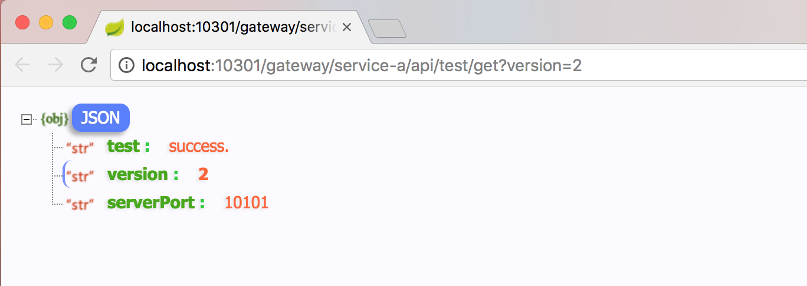
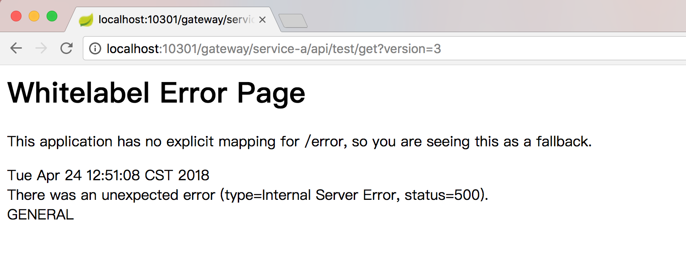
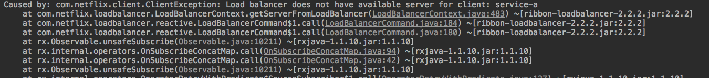

## 多版本控制使用说明
(以下说明都是假设浏览者对spring-cloud-netflix有过了解)
在使用多版本控制时，需要修改服务提供方和服务消费方，分别是application.yaml和pom.xml。

1、在服务提供方的application.yaml中添加versions属性，标明服务支持哪些版本。
* eureka
```yaml
spring:
  application:
    name: service-a
server:
  port: 10101
eureka:
  client:
    register-with-eureka: true
    fetch-registry: true
    serviceUrl:
      defaultZone: http://localhost:10001/eureka/
  instance:
    instanceId: ${spring.application.name}:${server.port}
    metadata-map:
      versions: 1,2
```
* zookeeper
```yaml
spring:
  application:
    name: service-c
  cloud:
    zookeeper:
      connect-string: 127.0.0.1:2181
      discovery:
        register: true
        root: dev
        metadata:
          versions: 1,2
server:
  port: 10101
```

2、在服务消费方，只需要在pom.xml添加spring-cloud-starter-multi-version到pom.xml依赖中即可，eureka和zookeeper的依赖二选一。
```xml
    <dependencies>
        <dependency>
            <groupId>org.springframework.boot</groupId>
            <artifactId>spring-boot-starter-web</artifactId>
        </dependency>
        <dependency>
            <groupId>org.springframework.boot</groupId>
            <artifactId>spring-boot-starter-test</artifactId>
        </dependency>
        <!-- eureka作为注册中心时使用 -->
        <dependency>
            <groupId>org.springframework.cloud</groupId>
            <artifactId>spring-cloud-starter-netflix-eureka-client</artifactId>
        </dependency>
        <!-- zookeeper作为注册中心时使用 -->
        <dependency>
            <groupId>org.springframework.cloud</groupId>
            <artifactId>spring-cloud-starter-zookeeper-discovery</artifactId>
        </dependency>

        <dependency>
            <groupId>org.apache.commons</groupId>
            <artifactId>commons-lang3</artifactId>
        </dependency>

        <dependency>
            <groupId>cn.springcloud.gray</groupId>
            <artifactId>spring-cloud-starter-multi-version</artifactId>
        </dependency>
    </dependencies>
```

以下例子中，在一个名为spring-cloud-bamboo-service-a-samples的项目中加入第1个步骤， 启动服务。网关spring-cloud-bamboo-zuul-samples做为服务消费方，在pom.xml中加入spring-cloud-starter-multi-version, 并在application.yaml中加入zuul的配置：
```yaml
ribbon:
  eureka:
    enabled: true
zuul:
  prefix: /gateway #为zuul设置一个公共的前缀
```

启动服务后，访问 http://localhost:10301/gateway/service-a/api/test/get?version=2 会返回数据，因为service-a支持version=2


如果访问http://localhost:10301/gateway/service-a/api/test/get?version=3 会报错， 因为找不到支持版本3的service-a服务实例



